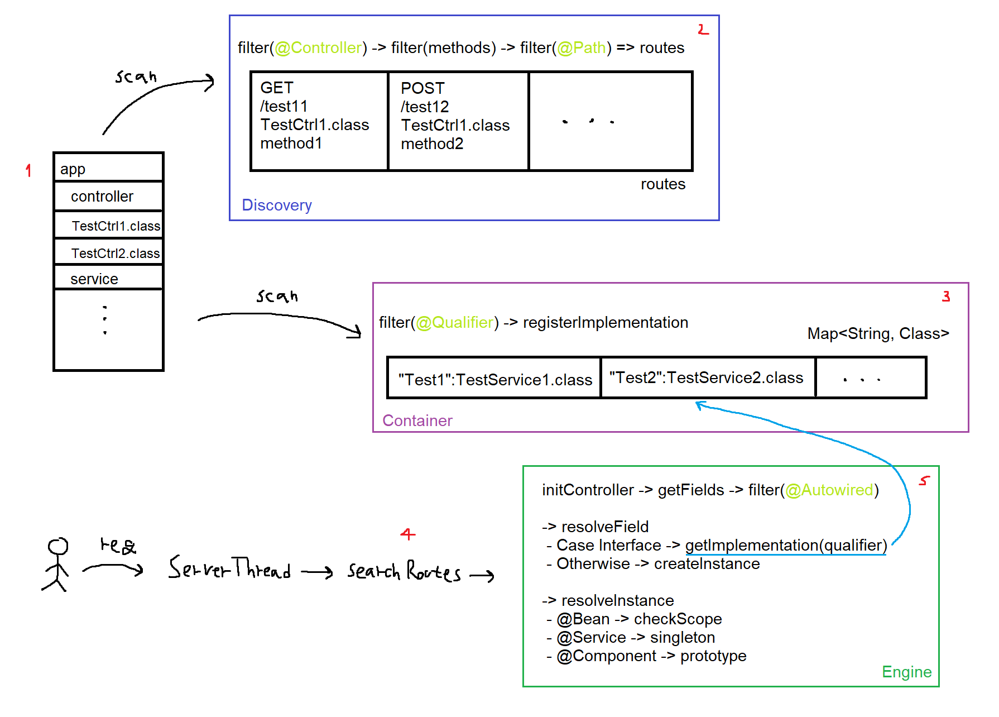

# NWP2-MiniWebFramework

The goal of this project is to create a custom Dependency Injection (DI) framework and a Discovery Engine to manage and set up different components of the application. The application is built to handle HTTP requests, using custom annotations to make development easier.

# Features
- **Dependency Injection**: Automatically injects dependencies using custom annotations.
- **Component Discovery**: Dynamically scans and registers components based on annotations.
- **HTTP Request Handling**: Processes HTTP requests and routes them to appropriate controllers.

# Flow
- The ScanUtils class scans the specified package and identifies all classes. It filters the classes based on annotations.
- The DiscoveryEngine uses ScanUtils to find all controllers in the project and map their methods to the appropriate objects.
- The DIContainer uses ScanUtils to find all classes annotated with @Qualifier annotations and map them to the appropriate classes.
- The ServerThread class handles incoming HTTP requests. It parses the request, identifies the appropriate controller and method using the DiscoveryEngine and processes the request afterwards.
- The DIEngine initializes the controller's fields recursively and checks for classes annotated with @Bean, @Service, or @Component to manage their lifecycle (supporting both singleton and prototype scopes).

